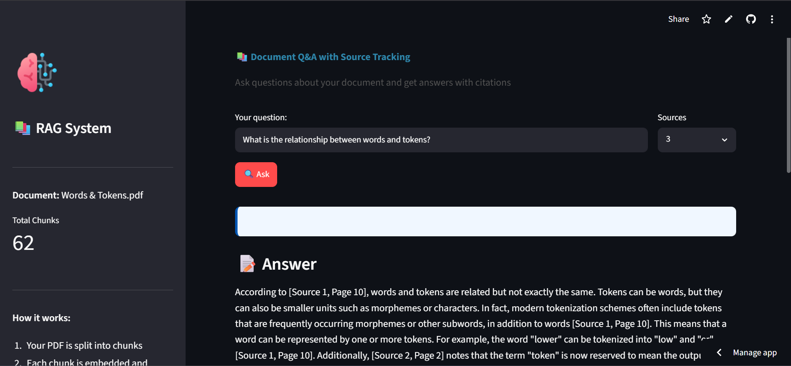
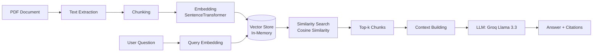

# 📚 RAG Document Q&A System

[](https://www.python.org/downloads/)
[](https://streamlit.io)
[](https://groq.com)
[](https://opensource.org/licenses/MIT)

A production-ready **Retrieval-Augmented Generation (RAG)** system that enables intelligent question-answering over PDF documents with precise source attribution.



## 🚀 Live Demo

**[View the Live App →](https://aiengineerjourney-kqgj4p4d26unfa2cohkwsw.streamlit.app)**

## ✨ Key Features

- **Accurate Q&A with Source Attribution**: Get answers with page-level citations (`[Source X, Page Y]`)
- **Interactive Web Interface**: Clean, responsive UI built with Streamlit
- **Fast Inference**: Powered by Groq's Llama 3.3 70B model
- **Document Chunking**: Intelligent text splitting with configurable chunk size and overlap
- **Semantic Search**: Embedding-based retrieval using SentenceTransformers
- **Real-time Feedback**: See retrieved chunks and sources for every answer

## 🏗️ Architecture



## 🛠️ Tech Stack

| Component | Technology |
|-----------|------------|
| **Frontend** | Streamlit |
| **Embeddings** | SentenceTransformers (all-MiniLM-L6-v2) |
| **Vector Search** | Custom in-memory with scikit-learn |
| **LLM** | Groq API (Llama 3.3 70B) |
| **PDF Processing** | PyPDF |
| **Language** | Python 3.12+ |

## 📦 Installation & Setup

### Prerequisites
- Python 3.12 or higher
- [Git](https://git-scm.com/)

### Step-by-Step Guide

1. **Clone the repository**
   ```bash
   git clone https://github.com/fantasticfahim/ai_engineer_journey.git
   cd ai_engineer_journey
   ```

2. **Create and activate a virtual environment**
   ```bash
   python -m venv venv
   # On Windows:
   venv\Scripts\activate
   # On macOS/Linux:
   source venv/bin/activate
   ```

3. **Install dependencies**
   ```bash
   pip install -r requirements.txt
   ```

4. **Set up your API key**
   - Get your Groq API key from [console.groq.com](https://console.groq.com)
   - Create a `.env` file in the project root:
   ```bash
   echo GROQ_API_KEY=your_api_key_here > .env
   ```

5. **Run the application**
   ```bash
   streamlit run app.py
   ```

6. **Open in browser**
   - Local URL: `http://localhost:8501`
   - Network URL: `http://YOUR_IP:8501`

## 🧪 Running Tests

```bash
# Install pytest
pip install pytest

# Run tests
pytest tests/
```

## 📁 Project Structure

```text
ai_engineer_journey/
├── app.py                      # Streamlit web interface
├── rag_system_simple.py        # Core RAG implementation
├── requirements.txt            # Python dependencies
├── pyproject.toml              # Modern Python packaging
├── Makefile                    # Automation commands
├── runtime.txt                 # Python version for deployment
├── .env                        # API keys (gitignored)
├── .gitignore                  # Git ignore rules
├── tests/                      # Unit tests
│   └── test_rag.py
└── Words & Tokens.pdf          # Example document
```

## 🤔 How It Works

1. **Document Ingestion**: PDF is extracted and split into overlapping chunks
2. **Embedding**: Each chunk is converted to a vector using SentenceTransformers
3. **Retrieval**: User question is embedded and compared to chunk vectors
4. **Generation**: Top-k chunks are sent to Groq LLM with a citation prompt
5. **Answer**: Response includes the answer with source citations

## 🔮 Future Enhancements

- [ ] Support for multiple document uploads
- [ ] Chat history and conversation memory
- [ ] Advanced reranking techniques
- [ ] Fine-tuned embedding models
- [ ] Hybrid search (keyword + semantic)

## 🤝 Contributing

Contributions are welcome! Please feel free to submit a Pull Request.

1. Fork the repository
2. Create your feature branch (`git checkout -b feature/AmazingFeature`)
3. Commit your changes (`git commit -m 'Add some AmazingFeature'`)
4. Push to the branch (`git push origin feature/AmazingFeature`)
5. Open a Pull Request

## 🛠️ Built With

- **[Streamlit](https://streamlit.io)** - Web framework
- **[SentenceTransformers](https://www.sbert.net/)** - Embedding models
- **[Groq](https://groq.com)** - Fast LLM inference
- **[PyPDF](https://pypi.org/project/pypdf/)** - PDF processing

## 📝 License

This project is licensed under the MIT License - see the [LICENSE](LICENSE) file for details.

## 🙏 Acknowledgements

- [SentenceTransformers](https://www.sbert.net/) for embedding models
- [Groq](https://groq.com) for fast LLM inference
- [Streamlit](https://streamlit.io) for the web framework

---

**Built with ❤️ by Fahim**